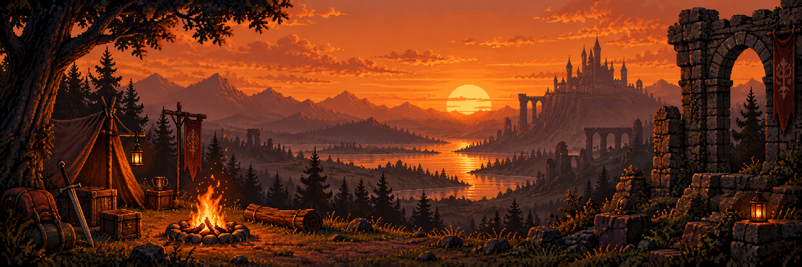
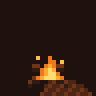

<div align="center">
  
  <br />
  <br />
  

# M I A C H O R E

### `CHARACTER SHEET · v1.0`

</div>

```text
╔══════════════════════════════════════════════════════════════╗
║                      ADVENTURER'S DOSSIER                    ║
╚══════════════════════════════════════════════════════════════╝
```

| FIELD | VALUE | FIELD | VALUE |
| :--- | :--- | :--- | :--- |
| **CLASS** | AI Artificer | **LEVEL** | Growing |
| **ALIGNMENT** | Curious Good | **ORIGIN** | GitHub |
| **PRIMARY TOOL** | Keyboard + coffee | **PARTY ROLE** | Builder |

## Ability Scores

> *Core attributes — rolled for code, not combat.*

| ATTRIBUTE | MODIFIER | WHAT IT MEANS |
| :--- | :---: | :--- |
| `DEBUGGING` | `+8` | Finding the one thing that broke everything |
| `CURIOSITY` | `+10` | Asking “what if?” and then trying it |
| `SHIP SPEED` | `+7` | Turning ideas into something real |
| `REFACTORING` | `+6` | Leaving the codebase cleaner than before |
| `BUG SENSE` | `+9` | Detecting suspicious behaviour before it bites |
| `AI ALCHEMY` | `+8` | Turning prompts and experiments into useful tools |

## Equipped Skills

<p>
  
  
  
  
</p>

```text
INVENTORY
  [x] Python spellbook        [x] JavaScript runes
  [x] Git waypoint map        [x] AI artificer's toolkit
```

## Current Quest

<table>
  <tr>
    <td width="112" align="center"></td>
    <td>
      <strong>Build, experiment, iterate.</strong><br />
      Turning curious ideas into working projects, one commit at a time.
    </td>
  </tr>
</table>

## Guild Records

<div align="center">
  
  
  <br />
  
</div>

---

<div align="center">

`Thanks for visiting the campfire.`

</div>
